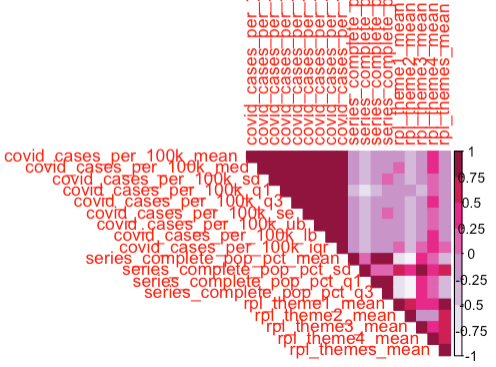
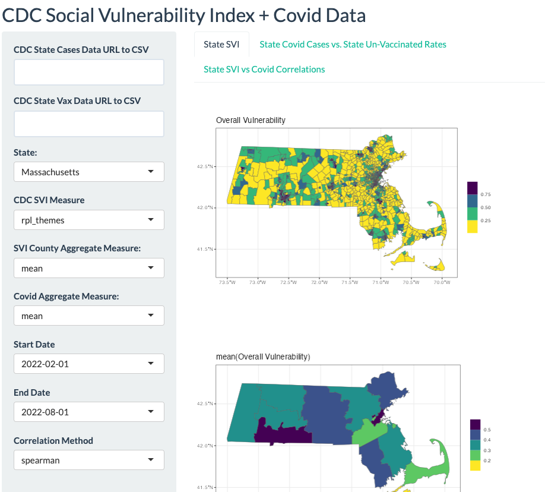
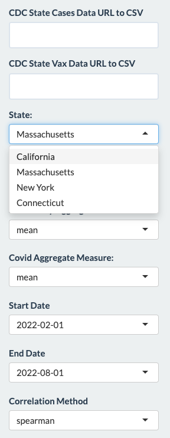
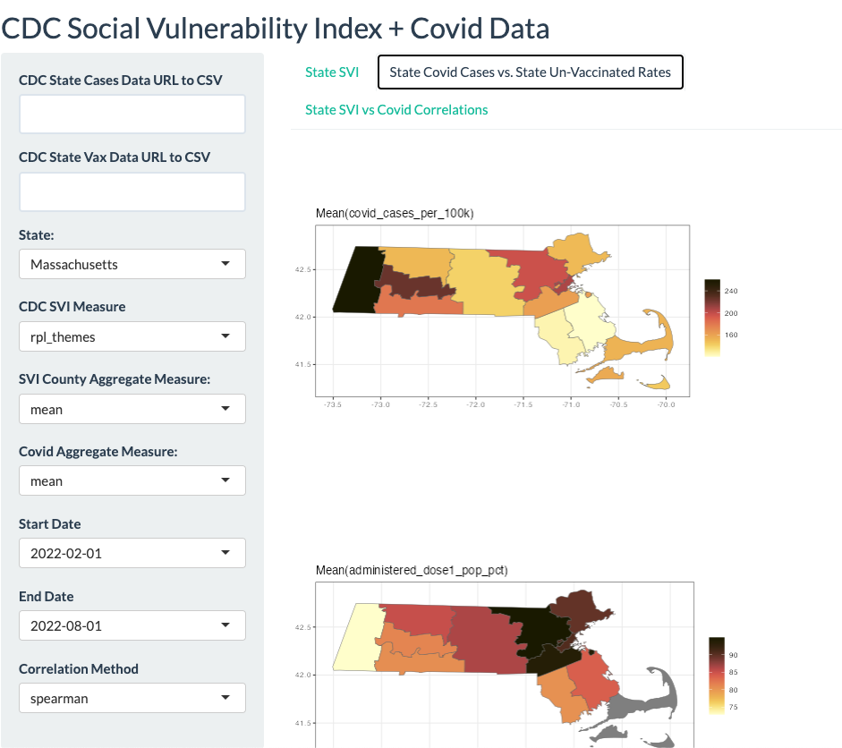
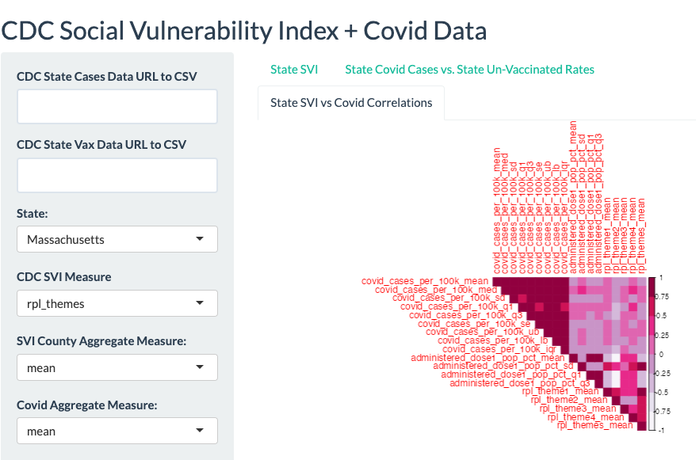
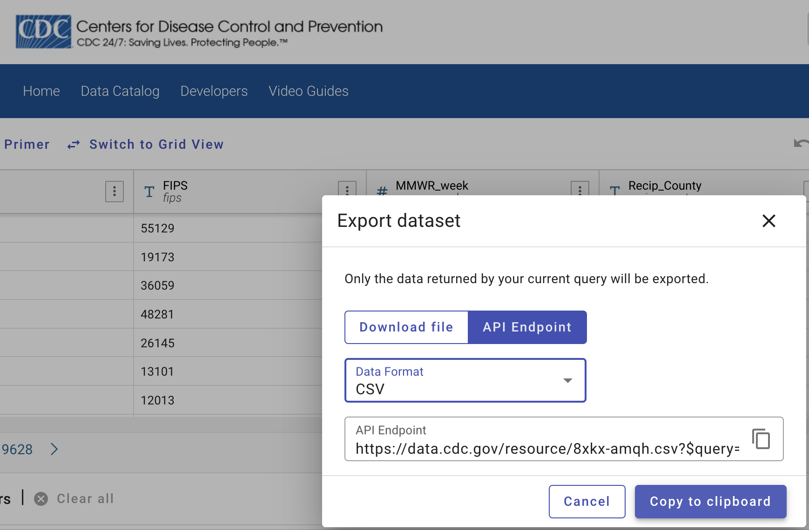

```{r, include = FALSE}
knitr::opts_chunk$set(
  collapse = TRUE,
  comment = "#>"
)

rm(list=ls())
```


```{r setup, echo=FALSE}
suppressPackageStartupMessages(library(bis620f23final))
suppressPackageStartupMessages(library(readr))
suppressPackageStartupMessages(library(DT))
suppressPackageStartupMessages(library(ggplot2))
suppressPackageStartupMessages(library(dplyr))
suppressPackageStartupMessages(library(corrplot))
suppressPackageStartupMessages(library(lubridate))
suppressPackageStartupMessages(library(RColorBrewer))
suppressPackageStartupMessages(library(ggpubr))
suppressPackageStartupMessages(library(kableExtra))
suppressPackageStartupMessages(library(sf))

suppressMessages(sf_use_s2(FALSE))
```
# Background


The COVID-19 pandemic has underscored the critical importance of equitable resource allocation, particularly in under-served and vulnerable communities. One tool that can significantly aid in this endeavor is the Centers for Disease Control and Prevention's (CDC) Social Vulnerability Index (SVI) [2]. The SVI uses 16 U.S. census variables to help local officials identify communities that may need support before, during, or after disasters. 

The CDC's Social Vulnerability Index (SVI) uses U.S. Census data to determine the social vulnerability of every Census tract. The SVI ranks tracts on several social factors and groups them into four related themes:

  1. **Socioeconomic Status**: This theme includes indicators related to the economic and social status of individuals, such as poverty, unemployment, and level of education.
  
  2. **Household Composition and Disability**: This theme includes indicators related to the age, disability status, and family structure of households. For example, it might consider the proportion of elderly individuals or single-parent households in a tract.
  
  3. **Racial & Ethnic Minority Status**: This theme includes indicators related to race and ethnicity, focusing on minority status and language. It might consider the proportion of individuals who belong to a racial or ethnic minority or who do not speak English fluently.
  
  4. **Housing Type & Transportation**: This theme includes indicators related to housing and transportation. For example, it might consider the proportion of overcrowded households, or households without a vehicle.


By leveraging the SVI, policymakers and health officials can gain a more detailed understanding of a community's social vulnerability to disasters, especially before hand, including public health emergencies like the COVID-19 pandemic. These areas of moderate and high SVI could then be prioritized for resource allocation, including testing, vaccination campaigns, and other public health interventions. As highlighted by a recent Stanford study, data science can play a pivotal role in addressing demographic disparities and ensuring that resources, such as covid diagnostic tests and vaccines, reach those who need them most [1]. By employing "uncertainty sampling", they were able to identify areas where there is most uncertainty around COVID-19 transmissions in East San Jose. "The areas where you are uncertain are probably exactly the area where you are most worried about the testing infrastructure not reaching everyone" [1]. 


## Research Question

It is unclear whether the SVI was developed to identify groups with low immunization rates or groups at risk for greater mortality from infectious diseases, but one or more SVI themes can support the claim that areas with high uncertainty around covid transmission rates are the areas that are most disporportionately affected by covid. The following post-hoc analysis is identifying areas where covid vaccines were distributed and comparing them to SVI and uncertainty around covid positive tets rates to assess if the vaccines were equitably distributed. What follows is merely a proof-of-concept tool and analyses. More time was spent on buidling a Shiny app (demoed below) than conducting a statistical experiment. Such analysis was complicated by the fact that covid tranmission and vaccination data by town and city were not found, only data the county level; therefore, estimating uncertainty around covid rates are not accurate.

```{r read data}
# update path to inst/data
project_data_dir <- "../inst/data"
svi_dir <- file.path(project_data_dir, "svi")

svi_tract_fname <- file.path(SVI_DIR, "SVI2018_US_tract.shp")
svi_tract_df <- read_sf(svi_tract_fname) |>
  dplyr::rename_with(tolower) |>
  dplyr::mutate_if(is.numeric, ~ ifelse(.x == -999, NA, .x))

SVI_STATES <- unique(svi_tract_df$state)
SVI_MEASURES <- svi_tract_df |>
  dplyr::select(starts_with("rpl_")) |>
  colnames()

state_names_and_abbr <- svi_tract_df |>
  dplyr::tibble() |>
  dplyr::select(state, st_abbr) |>
  dplyr::distinct()

# GLOBAL VARIABLES
STATE_ABBR_DICT <- split(state_names_and_abbr$st_abbr, state_names_and_abbr$state)
SVI_MEASURES <- SVI_MEASURES[SVI_MEASURES!= 'geometry']
SVI_THEMES_DICT <- list(
  "rpl_theme1" = "Socioeconomic Status",
  "rpl_theme2" = "Household Characteristics",
  "rpl_theme3" = "Racial & Ethnic Minority Status",
  "rpl_theme4" = "Housing Type & Transport",
  "rpl_themes" = "Overall Vulnerability"
)

covid_cases_fname <- file.path(COVID_DIR, "United_States_COVID-19_Community_Levels_by_County.csv")
covid_vax_rates_fname <- file.path(COVID_DIR, "COVID-19_Vaccinations_in_the_United_States_County.csv")
```


## Data Cleaning and Exploration

SVI data contains measures on all 50 US state and District of Columbia. For the following analysis only one state will be processed.

```{r process SVI data, out.width="50%", out.height="50%"}
ma_state_name = "MASSACHUSETTS"

ma_svi_tract_df <- svi_tract_df |>
  get_state_svi_tract(state_name = ma_state_name) 

ma_county_tract_svi <- ma_svi_tract_df |>
  summarize_state_county_svi_tracts()

ma_county_tract_svi |>
  dplyr::tibble() |>
  dplyr::select(-c(county, geometry)) |>
  gtsummary::tbl_summary() |>
  gtsummary::as_kable() |>
  kableExtra::kable_styling(font_size = 10)
```
Massachusetts has unique 14 counties as noted by the sample size above. 

SVI also contains geographic SF geom objects that map data visually at the town and city level as well as the county level.

```{r SVI town and county level tracts}
ma_svi_tract_theme1_plt <- plot_state_svi(
  st_svi_tract_df=ma_svi_tract_df,
  svi_theme="rpl_theme1"
)

ma_svi_tract_theme2_plt <- plot_state_svi(
  st_svi_tract_df=ma_svi_tract_df,
  svi_theme="rpl_theme2"
)


ma_county_med_svi_plt <- plot_state_svi(
  st_svi_tract_df=ma_county_tract_svi,
  svi_theme="rpl_themes",
  agg_col="median"
)

ma_county_mean_svi_plt <- plot_state_svi(
  st_svi_tract_df=ma_county_tract_svi,
  svi_theme="rpl_themes",
  agg_col="mean"
)

ma_svi_figure <- ggpubr::ggarrange(
  ma_svi_tract_theme1_plt, ma_svi_tract_theme2_plt, ma_county_med_svi_plt, ma_county_mean_svi_plt,
  # labels = c("Baby Sex", "Mother's Race"),
  ncol = 2, nrow = 2)

# ma_svi_figure

annotate_figure(
  ma_svi_figure,
  top = text_grob("Town-level vs County-level SVI Measures", color = "blue", face = "bold", size = 14))
```


Custom data cleaning will need to be done on the covid datasets all depending on where they are sourced from. For example, to help standardize column names, they we were all made lower case. Regarding the covid vaccination data, certain columns were renamed as well, i.e `recip_county` to `county`. `process_covid_df()` takes the county name and simplifies it, e.g. `Worcester County` to `Worcester`. It also takes in a date column argument as well as start and end dates on which to filter the covid data. It is assumed the date column is read in as a character and will need to be converted to a date. By default, the expected date format is `%Y-%m-%d`. If `date` column name already exists, then it will overwrite the that column as well.

```{r process covid data}
covid_start_date <- lubridate::ymd("2022-02-01")
covid_end_date <- lubridate::ymd("2022-05-01")

# when processing covid
cdc_covid_st_county_cases_df <- read.csv(covid_cases_fname) |>
  rename_with(tolower) |>
  process_covid_df(
    county_colname="county",
    start_date=covid_start_date,
    end_date=covid_end_date,
    date_col='date_updated')

cdc_covid_st_county_vax_rates_df <- read.csv(covid_vax_rates_fname) |>
  rename_with(tolower) |>
  rename("county" = "recip_county", "st_abbr" = "recip_state") |>
  process_covid_df(
    county_colname="county",
    start_date=covid_start_date,
    end_date=covid_end_date,
    date_col="date",
    format="%m/%d/%Y")
```


Once cleaned, we can aggregate our covid data to be at the state-county level. By joining these summarized covid datasets with the SVI geometries,
we can now plot our covid stats geographically.

The following shows aggregated covid cases by county.

```{r visual summary of aggregated covid cases, out.width="90%", out.height="75%"}
# covid cases per 100k
ma_county_svi_covid_cases_df <- summarize_state_covid_cases(
    covid_st_county_cases_df=cdc_covid_st_county_cases_df,
    st_county_svi_df=ma_county_tract_svi,
    state_name=tolower(ma_state_name),
    covid_cases_colname = "covid_cases_per_100k")

# can define a title based on covid_cases_colname and agg_col
ma_county_covid_cases_mean_plt <- plot_state_county_covid_cases(
  st_county_svi_covid_cases_df=ma_county_svi_covid_cases_df,
  covid_cases_colname="covid_cases_per_100k",
  agg_col="mean"
)

# can also apply a user-defined plot title
ma_county_covid_cases_ub_plt <- plot_state_county_covid_cases(
  st_county_svi_covid_cases_df=ma_county_svi_covid_cases_df,
  covid_cases_colname="covid_cases_per_100k",
  agg_col="ub",
  plot_title="Upper Bound(MA Covid Cases per 100k)"
)

# covid hospital admissions per 100k
ma_county_svi_covid_hosp_admin_df <- summarize_state_covid_cases(
    covid_st_county_cases_df=cdc_covid_st_county_cases_df,
    st_county_svi_df=ma_county_tract_svi,
    state_name=tolower(ma_state_name),
    covid_cases_colname = "covid_hospital_admissions_per_100k")

ma_county_svi_covid_hosp_admin_iqr_plt <- plot_state_county_covid_cases(
  st_county_svi_covid_cases_df=ma_county_svi_covid_hosp_admin_df,
  covid_cases_colname="covid_hospital_admissions_per_100k",
  agg_col="iqr",
  plot_title="IQR(MA County-level Hopsital Admissions per 100k)"
)

ma_covid_cases_figure <- ggpubr::ggarrange(
  ggpubr::ggarrange(ma_county_covid_cases_mean_plt, ma_county_covid_cases_ub_plt, ncol=2), 
  ma_county_svi_covid_hosp_admin_iqr_plt,
  nrow = 2,
  widths = c(2, 2))

annotate_figure(
  ma_covid_cases_figure,
  top = text_grob("MA County-level Covid Stats", color = "blue", face = "bold", size = 14))
```

Covid vaccination data can be processed in a similar way.

```{r covid vax rates}
ma_county_svi_covid_dose1_vax_rates_df <- summarize_state_covid_vax_rates(
  covid_st_county_vax_rates_df=cdc_covid_st_county_vax_rates_df,
  st_county_svi_df=ma_county_tract_svi,
  state_name=ma_state_name,
  covid_vax_rate_colname="administered_dose1_pop_pct") |>
  # add custom column
  mutate(unadministered_dose1_pop_pct_mean = 100 - administered_dose1_pop_pct_mean)

ma_county_svi_covid_dose1_vax_rates_mean_plt <- plot_state_county_covid_vax_rates(
  covid_st_county_vax_rates_df=ma_county_svi_covid_dose1_vax_rates_df,
  covid_vax_rate_colname="unadministered_dose1_pop_pct",
  agg_col="mean",
  plot_title="MA Average Dose 1 Covid Un-vax'd Rates"
)

ma_county_svi_covid_series_complete_df <- summarize_state_covid_vax_rates(
  covid_st_county_vax_rates_df=cdc_covid_st_county_vax_rates_df,
  st_county_svi_df=ma_county_tract_svi,
  state_name=ma_state_name,
  covid_vax_rate_colname="series_complete_pop_pct"
)

ma_county_svi_covid_series_complete_df_med_plt <- plot_state_county_covid_vax_rates(
  covid_st_county_vax_rates_df=ma_county_svi_covid_series_complete_df,
  covid_vax_rate_colname="series_complete_pop_pct",
  agg_col="med",
  plot_title="MA Median Series Complete Covid Vax Rates"
)
  
ma_covid_vax_rates_figure <- ggpubr::ggarrange(
  ma_county_svi_covid_dose1_vax_rates_mean_plt, ma_county_svi_covid_series_complete_df_med_plt, 
  nrow=2,
  widths = c(2, 2))

annotate_figure(
  ma_covid_vax_rates_figure,
  top = text_grob("MA County-level Covid Vaccination Rates", color = "blue", face = "bold", size = 14))
```

# Analysis

The correlation matrix function currently only computes pearson, spearman, and kendall correlation coefficients. The following outlines a brief description of each coefficient.

    1. **Pearson Correlation Coefficient**: This measures the linear relationship between two continuous variables. It assumes linearity and homoscedasticity and is sensitive to outliers. Pearson's correlation is most appropriate when both variables are normally distributed and the relationship between the variables is linear.
    
    2. **Spearman Rank Correlation Coefficient**: This is a non-parametric test that is used to measure the degree of association between two variables. It's used when the relationship is monotonic.
    
    3. **Kendall's Tau Coefficient**: This is a measure of rank correlation, which assesses the similarity of the orderings of the data when ranked by each of the quantities. It's often used for two qualitative ordinal variables. Kendall's Tau is more robust and efficient than Spearman's correlation, making it preferred when there are small samples or outliers.

The value add of these functions is to 1) visually inspect relations between SVI and covid summary statistics. Does mean or med SVI measure correlate strongly with covid vaccination rates or hospital admission rates? 2) Quantify these relations to provide evidence on where and why resources should be deployed. Further advanced, spatial-temporal statistical analysis would certainly benefit the adoption and deployment of such a dashboard.

```{r cross-referencing SVI data with covid data}
# create a single data frame with all county measures
ma_svi_covid_corr_matrix <- build_correlation_matrix(
  st_county_svi_covid_cases_df=ma_county_svi_covid_cases_df, 
  st_county_svi_covid_vax_rates_df=ma_county_svi_covid_series_complete_df, 
  corr_method="spearman"
)
```
The correlation plot does not render cleanly in the vignette, so I have zoomed in screenshot. Certainly, features names can be shortned to make the correlation visual more readable.

```{r screenshot of corr matrix, echo=FALSE}

```

From visual inspection we that
  - Mean and median covid cases per 100k are moderately correlated with SVI theme 4, which measures housing type and transportation.
  - Standard deviation of series complete is strongly correlated with SVI themes 1, 3, and total; themes 1 and 3 measure socioeconomic status and racial and ethnic minority status.
  
This suggests that merely focusing on central modes of tendency does not reveal too much about a county's SVI, but looking at a measure of uncertainty or spread does as suggested by `sd(series complete population percentage)`.

# Running the Shiny App

A shiny app was created to aid the visual analysis of the SVI and covid datasets. The app contains many features already covered that allow the user to select which dates to filter the covid data on, which state to analyze which correlation measure to use among other inputs. While not fully integrated and tested, the ability for users to feed in their own data from CDC's [covid-19 community levels by county](https://data.cdc.gov/Public-Health-Surveillance/United-States-COVID-19-Community-Levels-by-County/3nnm-4jni/about_data) and [covid-19 vaccinations by county databases](covid.cdc.gov/covid-data-tracker/#vaccination-archive-landing) is possible as well (see screenshot below for a reference). Of course other town, county, and state level datasets can be integrated by they would each require custom pre-processing to be summarized, visualized, and analyzed.


```{r running shiny app, eval=FALSE}
# update appDir path
shiny::runApp(appDir="../R/")
```

The following are screenshots show casing the proof-of-concept dashboard.

#### Landing Page + SVI Visual Summary
```{r screenshot of shiny app svi visuals, out.width='60%', out.height="60%"}

```

#### User inputs
```{r screenshot of user inputs, out.width='40%', out.height="30%"}

```

#### Covid Summary Statistics
```{r screenshot of covid stats, out.width='60%', out.height="60%"}

```

#### Correlation Matrix
```{r screenshot of shiny app corr matrix, out.width='40%', out.height="40%"}

```

#### Fetching more data: CDC Database API
```{r screenshot of cdc database api, out.width = '60%', out.height="60%"}

```


# Intrepretation & Conclusions

The covid data sourced from the CDC unfortunately do not provide information at the town or city level, therefore the analysis above is not actionable or accurate. However, the ability to visualize analyze county-level data is a powerful tool for local officials navigating through public health emergencies. The functions defined are flexible enough that any spatial-temporal dataset can be aggregated and compared with SVI at the state and county levels.

There also ample for feature improvement particularly for enhancing future spatial, statistical analysis at city level. Correlation measures can be expanded to account for data with temporal and spatial strucutre. This can enable hierarchical and cluster analysis where data is well captured for one city but not surroundings areas. If the shiny app is able to be hosted on a server and can be feed data regularly or in real-time, then more customization of plots and design elements would be added.


# References

(1) "How Stanford scholars collaborated with county health officials and a local community to allocate COVID-19 resources, address health disparities". Stanford News. https://news.stanford.edu/2021/08/27/using-data-science-allocate-covid-19-resources-address-demographic-disparities/.

(2) CDC/ATSDR Social Vulnerability Index (SVI). Agency for Toxic Substances and Disease Registry. https://www.atsdr.cdc.gov/placeandhealth/svi/index.html.

(3) Social Vulnerability Index | Vaccination Hesistancy. Centers for Disease Control and Prevention. https://data.cdc.gov/Vaccinations/Social-Vulnerability-Index/ypqf-r5qs.

(4) How the Social Vulnerability Index (SVI) Provides Insights into Vaccination Coverage Inequities. Centers for Disease Control and Prevention. https://blogs.cdc.gov/healthequity/2023/08/29/how-the-social-vulnerability-index-svi-provides-insights-into-vaccination-coverage-inequities/.

(5) Upper Confidence Bound Algorithm in Reinforcement Learning. Geek for Geeks. https://www.geeksforgeeks.org/upper-confidence-bound-algorithm-in-reinforcement-learning/


